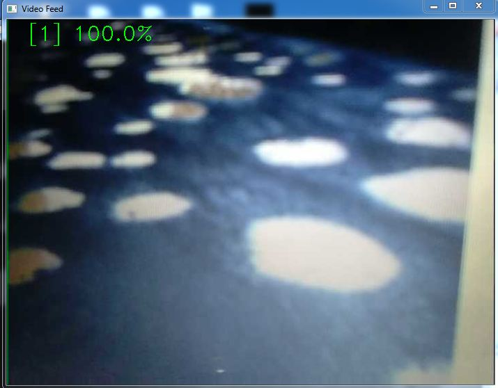
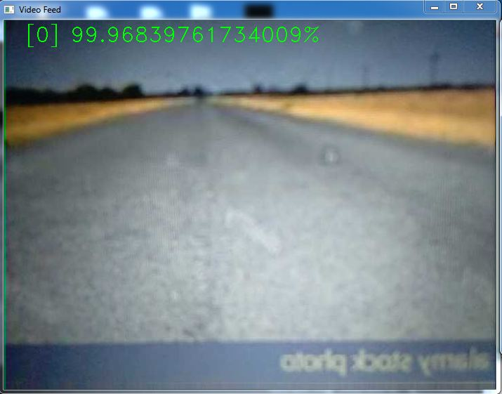

### Pot-Hole

A pothole is a depression in a road surface, usually asphalt pavement, where traffic has removed broken pieces of the pavement. It is usually the result of water in the underlying soil structure and traffic passing over the affected area. Water first weakens the underlying soil; traffic then fatigues and breaks the poorly supported asphalt surface in the affected area. Continued traffic action ejects both asphalt and the underlying soil material to create a hole in the pavement. 
### Formation

According to the US Army Corps of Engineers, pothole formation requires two factors to be present at the same time: water and traffic. Water weakens the soil beneath the pavement while traffic applies the loads that stress the pavement past the breaking point. Potholes form progressively from fatigue of the road surface which can lead to a precursor failure pattern known as crocodile (or alligator) cracking. Eventually, chunks of pavement between the fatigue cracks gradually work loose, and may then be plucked or forced out of the surface by continued wheel loads to create a pothole. 

In areas subject to freezing and thawing, frost heaving can damage a pavement and create openings for water to enter. In the spring, thaw of pavements accelerates this process when the thawing of upper portions of the soil structure in a pavement cannot drain past still-frozen lower layers, thus saturating the supporting soil and weakening it. 

Potholes can grow to several feet in width, though they usually only develop to depths of a few inches. If they become large enough, damage to tires, wheels, and vehicle suspensions is liable to occur. Serious road accidents can occur as a direct result, especially on those roads where vehicle speeds are greater.
 
Potholes may result from four main causes:
 
1. Insufficient pavement thickness to support traffic during freeze/thaw periods without localized failures 
2. Insufficient drainage 
3. Failures at utility trenches and castings (manhole and drain casings) 
4. Pavement defects and cracks left unmaintained and unsealed so as to admit moisture and compromise the structural integrity of the pavement 

### Working 
We can classify the dataset which either download from kaggle or built your own. After that save the model for future use. Open camera so that we can detect real time pot hole. This method is also applicable on images. Taking the input from camera and processed it using CNN and predict with model which is already saved. This process will return the class name and probability. Used class name and probability as output. The output will classify into three categories that are:  1. Pot-Hole 2. Plain-Road 3. None 

### Outputs
 
 
 
