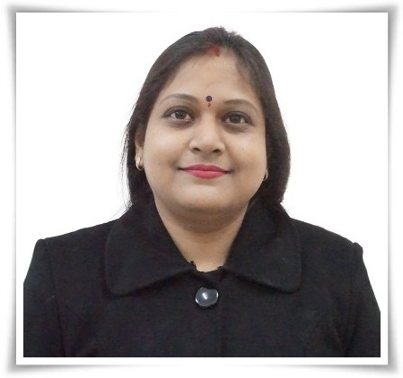
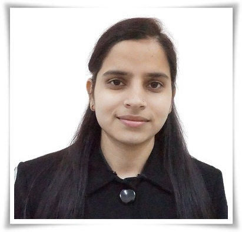
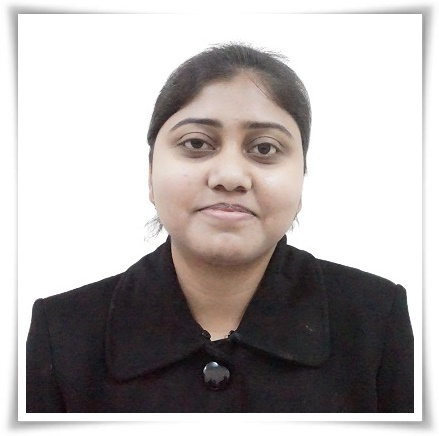
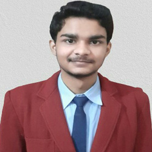
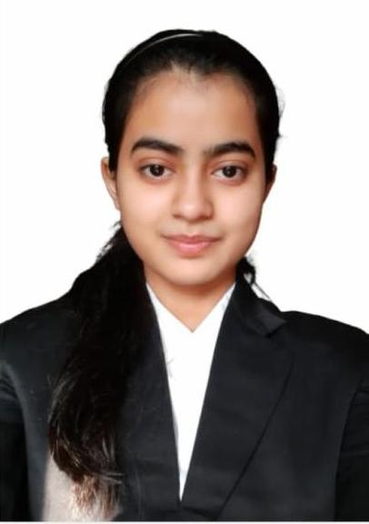
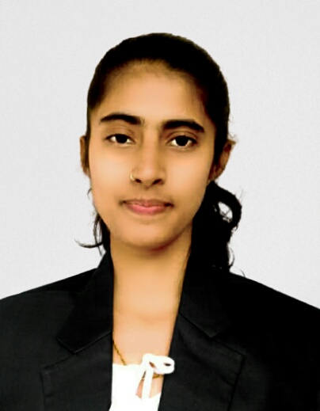

### Project work in progress
## Introduction 

 

<b>Discipline | <b>Computer Science and Engineering
:--|:--|
<b> Project Name | <b> Accident Control Management System
<b> Field |     <b> 1. Machine Learning 2. Computer Vision 3. Internet of Things

<h5> About the Objective of Project  : </h5>

The main objective of this Accident Control Management System is to provide an efficient system to resolve the most common real world problems which is road accidents. 
This system will provides an efficient solution of all possible way of road accidents like drowsy driver, drunk and drive, wrong lane e.t.c. 
This system is also includes its negative aspect and try to resolve them.

# Accident Control Management System
<b ><i>1. Cause of Road Accident</i></b> 
A): Distracted Driving 
B): Drunk Driving 
C): Speeding/ Reckless Driving 
D): Tailgating 
E): Driving on the opposite side on a one-way 
F): Road accidents caused due to animals 

*Note: For detailed information checked out <a href="https://www.reliancegeneral.co.in/Insurance/Knowledge-Center/Blogs/Common-Causes-of-Road-Accidents-in-India.aspx">this</a> and <a href="https://www.prsindia.org/policy/vital-stats/overview-road-accidents-india">this</a> link*

<h5> Target Audience : </h5>
1. Car Companies 
2. Public (User) 
3. Students (For technical education) 

<h5> Course Alignment : </h5>

Bachelor of Technology

<h5> Universities Mapped : </h5>

Dr. A.P.J. Abdul Kalam Technical University, Lucknow, Uttar Pradesh
  
#### Mentor Details

<b>Mentored by | <b>  Dr. Shachi Mall 
:--|:--|
<b> Institute | <b> Institute of Technology & Management, GIDA, Gorakhpur
<b> Email id|     <b> shachimallitm@gmail.com
<b> Department | Department of Computer Science (HOD) 
<b> Area of Interest | 1. Artificial Intelligence 2. Natural Language Processing 3. Machine Learning
<b> Photo | 

<b>Mentored by | <b>  Ms. Preeti Yadav 
:--|:--|
<b> Institute | <b> Institute of Technology & Management, GIDA, Gorakhpur
<b> Email id|     <b> preetiyadav.cse2018@gmail.com
<b> Department | Department of Computer Science
<b> Area of Interest | 1. Machine learning 2. Cloud Computing
<b> Photo | 

<b>Mentored by | <b>  Ms. Meenakshi Srivastava
:--|:--|
<b> Institute | <b> Institute of Technology & Management, GIDA, Gorakhpur
<b> Email id|     <b> srivastavameenakshi05@gmail.com
<b> Department | Department of Computer Science
<b> Area of Interest | 1. Internet of Things 2. Cloud Computing 
 <b> Photo | 
#### Developer Team

SrNo | Name | Faculty or Student | Department| Institute | Email id |Photo
:--|:--|:--|:--|:--|:--| :--|
1 | Abhishek Mishra | Student | Computer Science and Engineering | Institute of Technology & Management, GIDA, Gorakhpur |mishraabhi8924@gmail.com | 
2 | Faiza Ghayas | Student | Computer Science and Engineerings| Institute of Technology & Management, GIDA, Gorakhpur | faizaghayas30@gmail.com |
3 | Saumya Tripathi | Student | Computer Science and Engineering | Institute of Technology & Management, GIDA, Gorakhpur | saumya051999@gmail.com |

The link of <a href="https://vcddxm6utnzciqbmzqzvwq-on.drv.tw/www.AccidentMS.com/" >Accident Control Management System </a> :point_left: .  Made with :sparkling_heart: .  Serve with 
:smiley:
