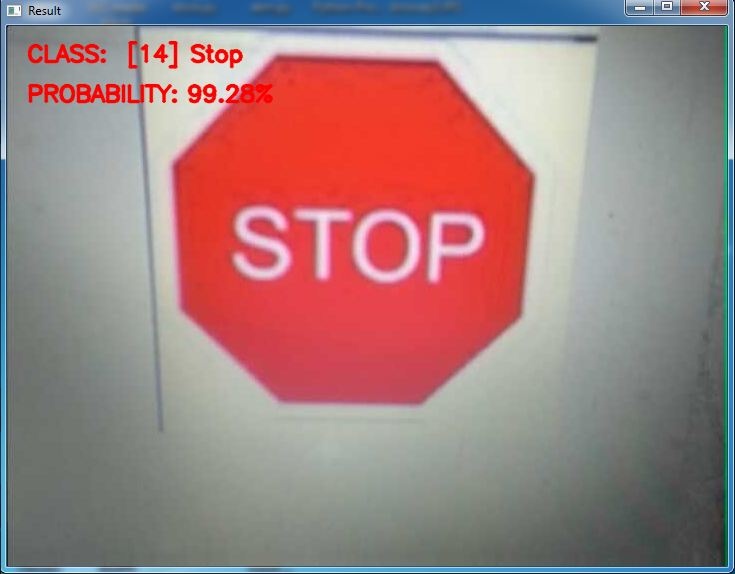
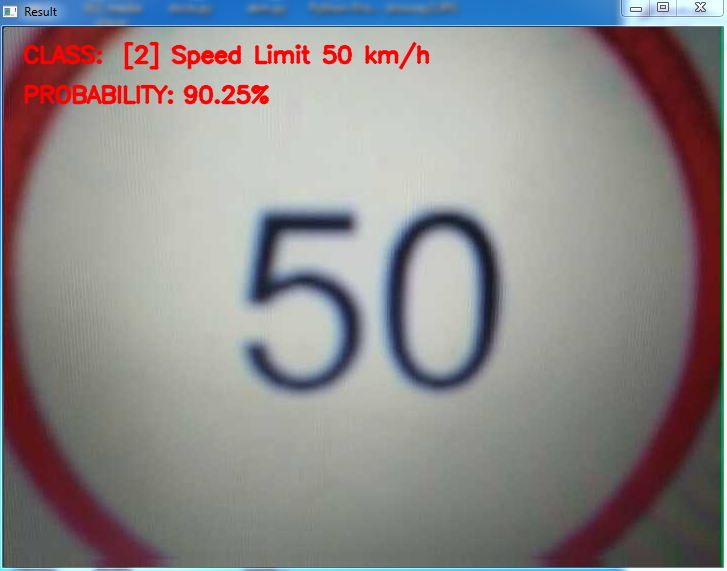

## Introduction
Traffic sign detection systems constitute a key component in trending real-world applications, such as autonomous driving, and driver safety and assistance. This paper analyses the state-of-the-art of several object-detection systems (Faster R-CNN, R-FCN, SSD, and YOLO V2) combined with various feature extractors (Resnet V1 50, Resnet V1 101, Inception V2, Inception Resnet V2, Mobilenet V1, and Darknet-19) previously developed by their corresponding authors. We aim to explore the properties of these object-detection models which are modified and specifically adapted to the traffic sign detection problem domain by means of transfer learning. In particular, various publicly available object-detection models that were pre-trained on the Microsoft COCO dataset are fine-tuned on the German Traffic Sign Detection Benchmark dataset. The evaluation and comparison of these models include key metrics, such as the mean average precision (mAP), memory allocation, running time, number of floating point operations, number of parameters of the model, and the effect of traffic sign image sizes. Our findings show that Faster R-CNN Inception Resnet V2 obtains the best mAP, while R-FCN Resnet 101 strikes the best trade-off between accuracy and execution time. YOLO V2 and SSD Mobilenet merit a special mention, in that the former achieves competitive accuracy results and is the second fastest detector, while the latter, is the fastest and the lightest model in terms of memory consumption, making it an optimal choice for deployment in mobile and embedded devices. 

## Working
1. Train the model using CNN and either custom dataset or downloaded dataset(from kaggle). 
2. Make a classification as per number of sign present in the dataset. 
3. Run a customize loop and validating each frame of the iinput video's. 
4. Predict the output as per classification and take apropriate decisions.
 
 
 ## Output
  
  
