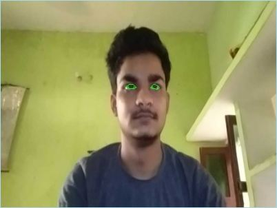
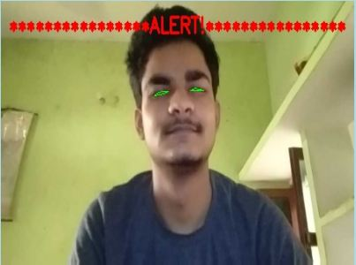
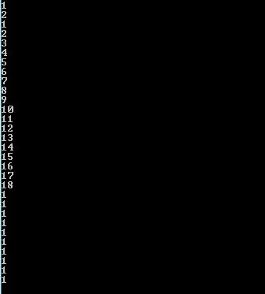

## Applications
This can be used by riders who tend to drive for a longer period of time that may lead to accidents


### Code Requirements
The example code is in Python ([version 2.7](https://www.python.org/download/releases/2.7/) or higher will work). 

### Dependencies

1) import cv2
2) import imutils
3) import dlib
4) import scipy


### Description

A computer vision system that can automatically detect driver drowsiness in a real-time video stream and then play an alarm if the driver appears to be drowsy.<br>
Driver drowsiness and attention warning and advanced driver distraction warning systems shall be designed in such a way that those systems do not continuously record nor retain any data other than what is necessary in relation to the purposes for which they were collected or otherwise processed within the closed-loop system. Furthermore, those data shall not be accessible or made available to third parties at any time and shall be immediately deleted after processing. Those systems shall also be designed to avoid overlap and shall not prompt the driver separately and concurrently or in a confusing manner where one action triggers both systems.(-regulation (EU) 2019/2144)
This system is also known as EyeSight Driver Assist,Tiredness Detection Warning, Anti Sleep Pilot,Fatigue detection system....

### Algorithm

Each eye is represented by 6 (x, y)-coordinates, starting at the left-corner of the eye (as if you were looking at the person), and then working clockwise around the eye:.


### Condition

It checks 15 consecutive frames and if the Eye Aspect ratio is less than 0.25, Alert is generated.

#### Relationship


#### Summing up


For more information, [see](https://www.pyimagesearch.com/2017/05/08/drowsiness-detection-opencv/)

### Execution
To run the code, type `python Drowsiness_Detection.py`

```
python Drowsiness_Detection.py
```
### Outputs
<br>
<br>

