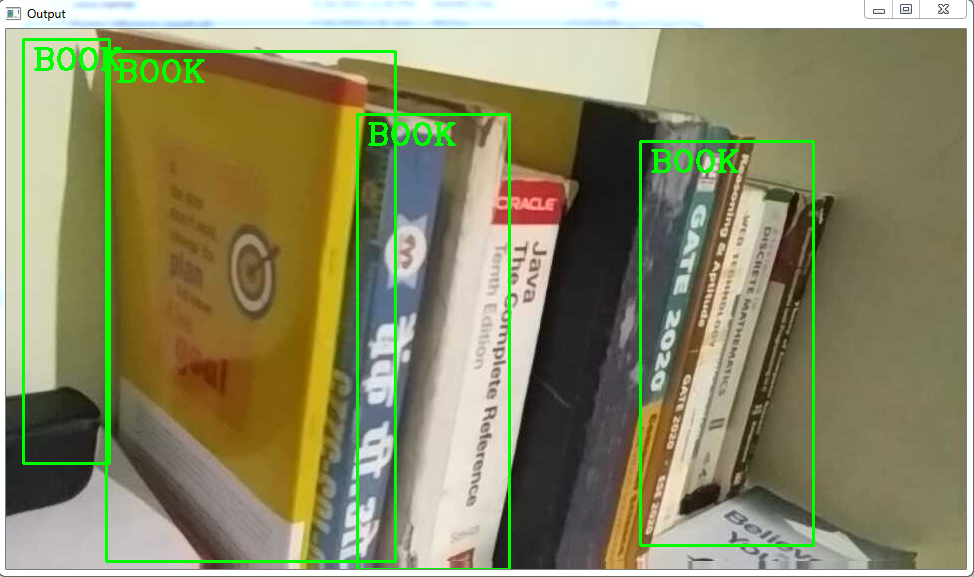
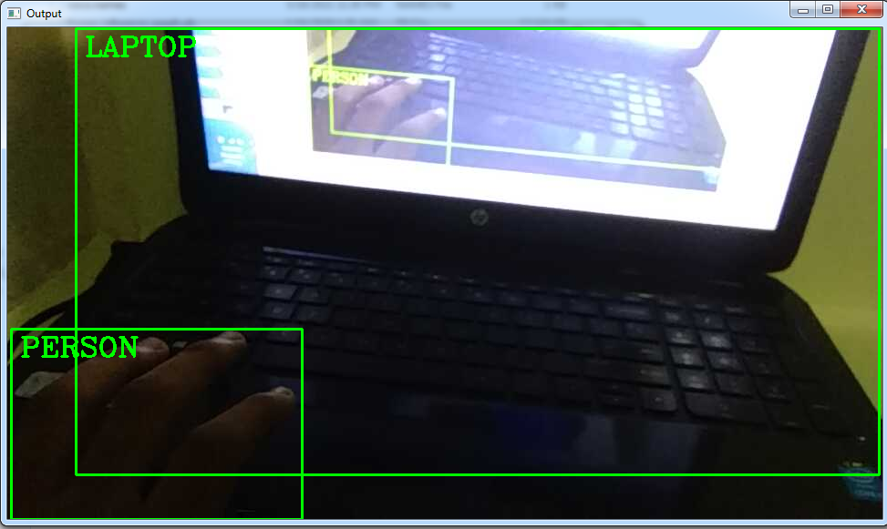

## What is Object Detection?
Object detection is a branch of computer vision which deals with the localization and the identification of an object. Object localization and identification are two different tasks that are put together to achieve this singular goal of object detection. 
Specifying the location of an object in an image or a video stream is called object localization and assigning the object to a specific label, class, or description is called object identification. 
 Some architectures that have performed tremendously well on the **<a href="https://drive.google.com/file/d/1whaHiSKfcb1Iws62Bzb-j2qeYx4WsZa-/view?usp=sharing">COCO dataset</a>**. 
The model architectures include: 
*1. CenterNet 
2. EfficientDet 
3. MobileNet 
4. ResNet 
5. R-CNN 
6. ExtremeNet *

Here we are going to use `MobileNet` architecture. Download the architecture from <a href="https://drive.google.com/file/d/1u7Fy7sS8Xp39HKgjhjuwlbDN7s5l1wjh/view?usp=sharing">Here</a> 
<b> MobileNet</b> is an object detector (2017) used as an efficient CNN architecture designed for mobile and embedded vision application. This architecture uses proven depth-wise separable convolutions to build lightweight deep neural networks. More information about the architecture can be found <a href="https://drive.google.com/file/d/1bxU16LQOs2MR6wCmpehwn6s_-S5dN4_B/view?usp=sharing">Here</a>. 
## Optimizing the model
Freezing the model means producing a singular file containing information about the graph and checkpoint variables, but saving these hyperparameters as constants within the graph structure. This eliminates additional information saved in the checkpoint files such as the gradients at each point, which are included so that the model can be reloaded and training continued from where you left off. As this is not needed when serving a model purely for inference they are discarded in freezing.
For more details checkout <a href="https://cv-tricks.com/how-to/freeze-tensorflow-models/#:~:text=Freezing%20is%20the%20process%20to,a%20serialized%20MetaGraphDef%20protocol%20buffer.">This</a>.
Download the `frozen_inference_graph.pb` freezing model from <a href="https://drive.google.com/file/d/1Z-6HOmtKEnFc-pV_GEJURFadQY2rDDba/view?usp=sharing">Here</a>.

## Working
This module is a part of Accident Control Management System. This will helpful in detection and recognition of objects. With this if any things is comes in front of vehicle then it will detect that and display the visuals. With the help of that visuals driver will able to take proper decision at right time. 
This module will work on IP WebCam by default. You can find the setup of IP WebCam is <a href="https://mishraabhi8924.medium.com/access-the-android-camera-to-python-using-opencv-3d5901f01f23">Here</a>.
This module will also work with system camera. To access the system camera use below code block:-  

    import cv2  
    thres = 0.45 # Threshold to detect object 
    cap = cv2.VideoCapture(1) #fill the index of your system camera, it is either 0,1 or 2 
    cap.set(3,1280) 
    cap.set(4,720) 
    cap.set(10,70) 
    classNames= [] 
    classFile = 'coco.names' 
    with open(classFile,'rt') as f: 
    classNames = f.read().rstrip('n').split('n') 
    configPath = 'ssd_mobilenet_v3_large_coco_2020_01_14.pbtxt' 
    weightsPath = 'frozen_inference_graph.pb' 
    net = cv2.dnn_DetectionModel(weightsPath,configPath) 
    net.setInputSize(320,320) 
    net.setInputScale(1.0/ 127.5) 
    net.setInputMean((127.5, 127.5, 127.5)) 
    net.setInputSwapRB(True) 
    while True: 
      success,img = cap.read() 
      classIds, confs, bbox = net.detect(img,confThreshold=thres) 
      print(classIds,bbox) 
      if len(classIds) != 0: 
        for classId, confidence,box in zip(classIds.flatten(),confs.flatten(),bbox): 
          cv2.rectangle(img,box,color=(0,255,0),thickness=2) 
          cv2.putText(img,classNames[classId-1].upper(),(box[0]+10,box[1]+30),
          cv2.FONT_HERSHEY_COMPLEX,1,(0,255,0),2) 
          cv2.putText(img,str(round(confidence*100,2)),(box[0]+200,box[1]+30),
          cv2.FONT_HERSHEY_COMPLEX,1,(0,255,0),2) 
      cv2.imshow('Output',img) 
      k=cv2.waitKey(1) 
      if k: 
        break 
    cv2.destroyAllWindows() 
    #release the frame 
    cap.release() 
## Output Screenshot
 

## How to run the script 
You can run this script by using cmd command, that is: 
   `python objectdetection-final.py`
   
For tracking the script follow <a href="https://mishraabhi8924.medium.com/how-to-track-our-python-script-files-f56fe1228d3f">This</a>:point_left: link
