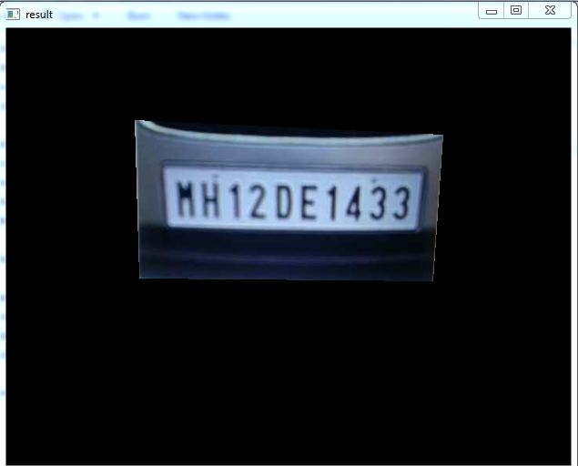

## Introduction
Plate number detection is combination of two part that are plate-number-recognition and plate-number-detection. Apart from that it is also use text extraction for saving the plate-number in csv file. 
With the help of this, it is easy to navigate the accidenter after doing an accident. Emergency services like police may be found the proper information abut that.
It will works on pattern that is match with number plate. If maching is successful then it save that particular plate-number. 
For extracting the text OCR (Optical Character Recognition) is used. And for Model CNN is used.

## Output
 
